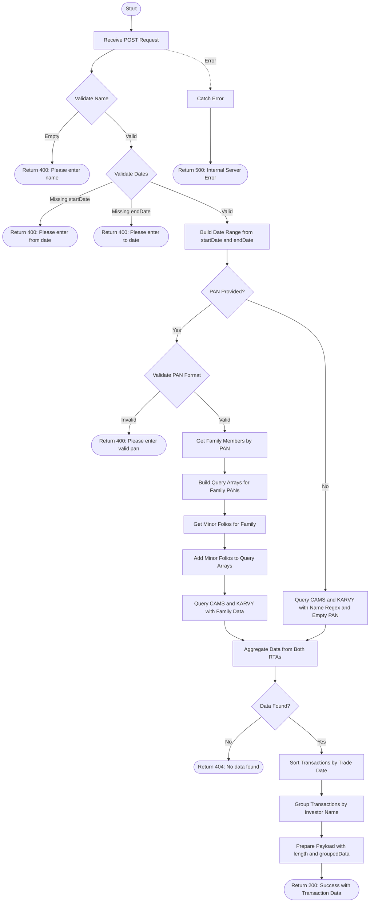

# Transaction Userwise
Retrieves transaction data for a specific user based on name and optional PAN, within a specified date range. When a PAN is provided, the API fetches transactions for the entire family (including family members and minor folios). Data is aggregated from both CAMS and KARVY registrars, sorted by trade date, and grouped by investor name.

### User flow diagram


### Method
```
POST
```

### Route
```
/transaction-userwise
```

### Authorization
```
Bearer <token>
```

### Request Body
```json
{
    "pan": "ABCDE1234F",
    "name": "John Doe",
    "startDate": "2024-01-01",
    "endDate": "2024-12-31"
}
```

### Parameters
| Name | Type | Description |
|------|------|-------------|
| name | String | **Required**. The name of the investor to search for. |
| startDate | String | **Required**. The start date for the transaction range (format: YYYY-MM-DD). |
| endDate | String | **Required**. The end date for the transaction range (format: YYYY-MM-DD). |
| pan | String | **Optional**. The PAN of the investor. If provided, fetches transactions for entire family including minors. Must match format: 5 letters, 4 digits, 1 letter. |

### Response `Status: (200)`
```json
{
    "status": true,
    "message": "Success",
    "payload": {
        "length": 2,
        "groupedData": {
            "John Doe": [
                {
                    "INVNAME": "John Doe",
                    "FOLIO": "1234567/89",
                    "SCHEME": "HDFC Liquid Fund",
                    "TRXNNO": "TXN001",
                    "TRADDATE": "2024-06-15",
                    "UNITS": 100.50,
                    "AMOUNT": 50000,
                    "TRXNTYPE": "Purchase",
                    "PAN": "ABCDE1234F"
                },
                {
                    "INVNAME": "John Doe",
                    "FOLIO": "1234567/89",
                    "SCHEME": "ICICI Prudential Equity Fund",
                    "TRXNNO": "TXN002",
                    "TRADDATE": "2024-07-20",
                    "UNITS": 50.25,
                    "AMOUNT": 25000,
                    "TRXNTYPE": "Redemption",
                    "PAN": "ABCDE1234F"
                }
            ],
            "Jane Doe": [
                {
                    "INVNAME": "Jane Doe",
                    "FOLIO": "9876543/21",
                    "SCHEME": "SBI Bluechip Fund",
                    "TRXNNO": "TXN003",
                    "TRADDATE": "2024-08-10",
                    "UNITS": 75.00,
                    "AMOUNT": 30000,
                    "TRXNTYPE": "Purchase",
                    "PAN": "XYZAB5678C"
                }
            ]
        }
    }
}
```

### Response `Status: (400)`
```json
{
    "status": false,
    "message": "Please enter name"
}
```

```json
{
    "status": false,
    "message": "Please enter from date"
}
```

```json
{
    "status": false,
    "message": "Please enter to date"
}
```

```json
{
    "status": false,
    "message": "Please enter valid pan"
}
```

### Response `Status: (404)`
```json
{
    "status": false,
    "message": "No data found"
}
```

### Response `Status: (500)`
```json
{
    "status": false,
    "message": "Error message details"
}
```

## API Behavior Details

### PAN Validation
- PAN format: 5 uppercase letters + 4 digits + 1 uppercase letter
- Example: `ABCDE1234F`
- Validation is case-insensitive

### Query Logic

#### With PAN:
1. Fetches all family members associated with the PAN
2. Retrieves minor folios for the family
3. Builds query arrays for both CAMS and KARVY:
   - **CAMS**: Matches on `PAN` field for family members and `FOLIO_NO` for minors
   - **KARVY**: Matches on `PAN1` field for family members and `TD_ACNO` for minors
4. Aggregates data from both RTAs using the family query

#### Without PAN:
1. Searches by name using regex (case-insensitive)
2. Filters for records with empty PAN field
3. Queries both CAMS (`INV_NAME`) and KARVY (`INVNAME`) collections

### Data Processing
1. **Aggregation**: Combines data from both CAMS and KARVY RTAs
2. **Sorting**: Transactions are sorted by trade date (`TRADDATE`)
3. **Grouping**: Results are grouped by investor name (`INVNAME`)
4. **Payload**: Returns the count of unique investors and their grouped transactions

### Helper Functions Used
- `buildDateRange(startDate, endDate)`: Converts date strings to date range objects
- `getfamilymember(pan)`: Retrieves family members for a given PAN
- `getminorfolio(familyMembers)`: Fetches minor folios for family members
- `buildPipelineUserwise()`: Constructs aggregation pipeline for transaction queries
- `sortByTradDate()`: Sorts transaction array by trade date
