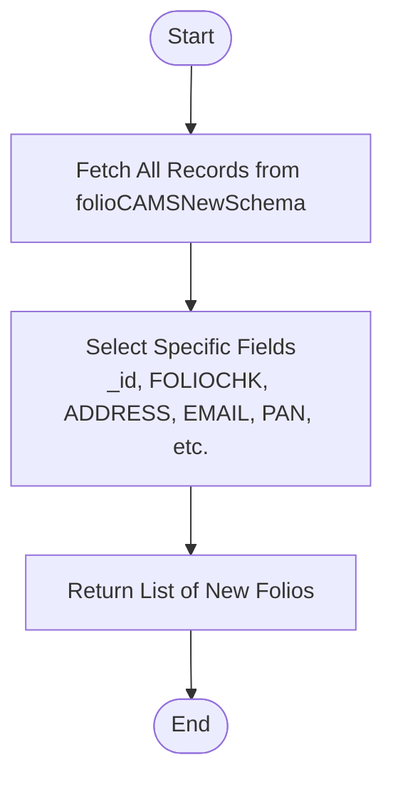

# Get New Folio Cams List
This API retrieves a list of new CAMS folios from the `folioCAMSNewSchema` collection. These are typically folios that have been newly identified during an upload process and may require verification or further processing.

### User flow diagram


### Method
```
GET
```

### Route
```
/upload/new-foliocams-list
```
*(Note: Route prefix `/upload` is assumed based on the context of this API usually residing in the upload controller/router, although the path snippet is `/new-foliocams-list`).*

### Authorization
```
Bearer <token>
```

### Parameters
None.

### Request Body
```json
{}
```

### Response `Status: (200)`
```json
{
    "success": true,
    "message": "Success",
    "data": {
        "length": <number_of_items>,
        "newFolios": [
            {
                "_id": "ObjectId",
                "FOLIOCHK": "String",
                "ADDRESS1": "String",
                "ADDRESS2": "String",
                "ADDRESS3": "String",
                "EMAIL": "String",
                "GUARD_PAN": "String",
                "INV_NAME": "String",
                "PAN_NO": "String",
                "PRODUCT": "String"
            }
            // ... more items
        ]
    }
}
```

### Response `Status: (500)`
```json
{
    "success": false,
    "message": "<Error Message>"
}
```
