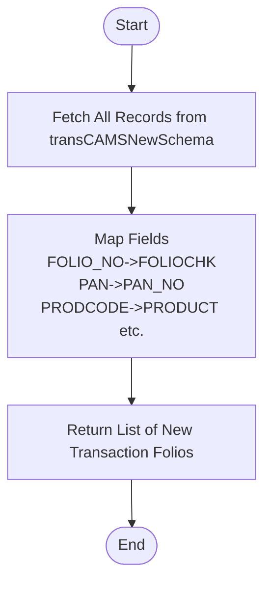

# Get New Folio Trans Cams List
This API retrieves a list of new CAMS transaction folios from the `transCAMSNewSchema` collection. These are typically new transaction records that have not yet been fully merged or matched with existing folios and require verification. The response maps specific fields (e.g., `FOLIO_NO` -> `FOLIOCHK`, `PAN` -> `PAN_NO`).

### User flow diagram


### Method
```
GET
```

### Route
```
/upload/new-folio-transcams-list
```
*(Note: Route prefix `/upload` assumed based on project structure).*

### Authorization
```
Bearer <token>
```

### Parameters
None.

### Request Body
```json
{}
```

### Response `Status: (200)`
```json
{
    "success": true,
    "message": "Successfull",
    "data": {
        "length": <number_of_items>,
        "newFolios": [
            {
                "_id": "ObjectId",
                "FOLIOCHK": "String (Mapped from FOLIO_NO)",
                "INV_NAME": "String",
                "PAN_NO": "String (Mapped from PAN)",
                "SCHEME": "String (Mapped from ACCORD_SHORTNAME)",
                "PRODUCT": "String (Mapped from PRODCODE)"
            }
            // ... more items
        ]
    }
}
```

### Response `Status: (500)`
```json
{
    "success": false,
    "message": "<Error Message>"
}
```
