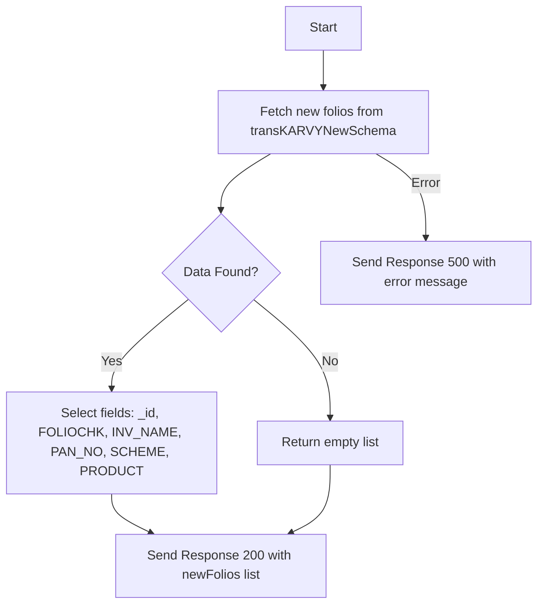

# Get New Folio TransKarvy List
This API retrieves a list of new folios from Karvy transactions, selecting specific fields like Folio Check, Investor Name, PAN Number, Scheme, and Product.

### User flow diagram


### Method
```
GET
```

### Route
```
/upload/new-folio-transkarvy-list
```
*Note: Route prefix '/upload' is assumed based on folder structure request, please verify if it belongs to a specific route group like '/api/upload' or similar.*

### Authorization
```
Bearer <token>
```

### Parameters
| Name | Type | Description |
|------|------|-------------|
| | | No parameters required |

### Sample Request
```http
GET: https://<host>/upload/new-folio-transkarvy-list
```

### Response
```json
{
    "code": 200,
    "status": true,
    "message": "Successful",
    "data": {
        "length": 1,
        "newFolios": [
            {
                "_id": "64f8a...",
                "FOLIOCHK": "12345678",
                "INV_NAME": "JOHN DOE",
                "PAN_NO": "ABCDE1234F",
                "SCHEME": "Equity Fund",
                "PRODUCT": "EQ"
            }
        ]
    }
}
```
