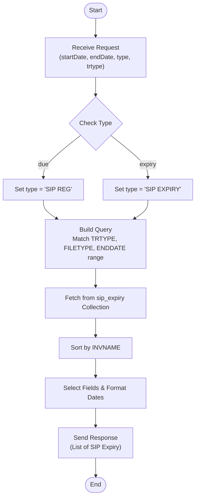

# Get SIP Expiry

This API retrieves a list of SIPs that are either due for registration or expiring within a specified date range. It allows filtering by transaction type and status (due/expiry).

### User flow diagram



### Method
```
POST
```

### Route
```
/get-sip-expiry
```

### Authorization
```
Bearer <token>
```

### Parameters
None.

### Request Body
```json
{
    "startDate": "YYYY-MM-DD",
    "endDate": "YYYY-MM-DD",
    "type": "due | expiry",
    "trtype": "String"
}
```

### Response `Status: (200)`
```json
{
    "success": true,
    "message": "Success",
    "data": {
        "length": 0,
        "sipExpiry": [
            {
                "ACNO": "String",
                "PRODCODE": "String",
                "AMOUNT": "Number",
                "INVNAME": "String",
                "EMAIL": "String",
                "IHNO": "String",
                "TRTYPE": "String",
                "STARTDATE": "DD-MM-YYYY",
                "ENDDATE": "DD-MM-YYYY",
                "TERMDATE": "DD-MM-YYYY",
                "SIPREGDT": "DD-MM-YYYY",
                "SCHEME": "String",
                "pan": "String",
                "FREQUENCY": "String",
                "MOBILE": "String"
            }
        ]
    }
}
```

### Response `Status: (500)`
```json
{
    "success": false,
    "message": "<Error Message>"
}
```
