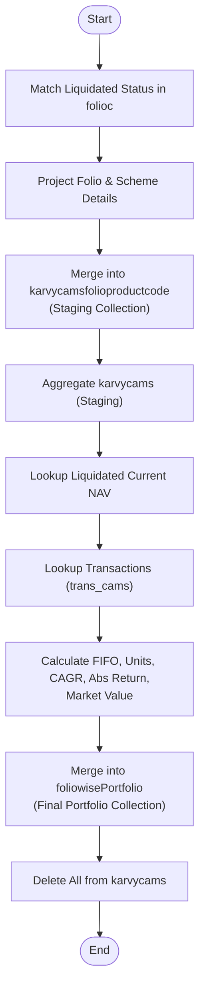

# Sync CAMS Liquidated Schemes

This API identifies and synchronizes liquidated schemes from CAMS portfolios. It isolates liquidated folios, calculates their detailed performance metrics using FIFO logic, and updates the central portfolio collection with the finalized data.

### User flow diagram



### Method
```
GET
```

### Route
```
/sync-cams-liquidated-schemes
```

### Authorization
```
Bearer <token>
```

### Parameters
None.

### Request Body
```json
{}
```

### Response `Status: (200)`
```json
{
    "success": true,
    "message": "Sync Successfully"
}
```

### Response `Status: (500)`
```json
{
    "success": false,
    "message": "<Error Message>"
}
```
