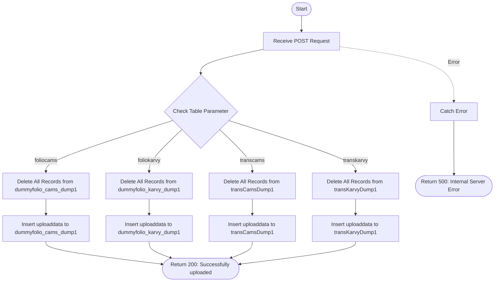

# Upload Dump
Uploads bulk data to temporary dump collections for CAMS and KARVY folio and transaction data. The API clears the existing data in the specified dump collection and inserts new data in bulk. This endpoint is used for staging data before processing or migration.

### User flow diagram


### Method
```
POST
```

### Route
```
/upload-dump
```

### Authorization
```
None (No token required)
```

### Request Body
```json
{
    "table": "foliocams",
    "uploaddata": [
        {
            "INV_NAME": "John Doe",
            "PAN_NO": "ABCDE1234F",
            "FOLIO_NO": "1234567/89",
            "SCHEME": "HDFC Equity Fund"
        },
        {
            "INV_NAME": "Jane Doe",
            "PAN_NO": "XYZAB5678C",
            "FOLIO_NO": "9876543/21",
            "SCHEME": "ICICI Balanced Fund"
        }
    ]
}
```

### Parameters
| Name | Type | Description |
|------|------|-------------|
| table | String | **Required**. The target dump table. Valid values: "foliocams", "foliokarvy", "transcams", "transkarvy". |
| uploaddata | Array | **Required**. Array of records to insert into the dump collection. |

### Response `Status: (200)`
```json
{
    "status": true,
    "message": "Successfully uploaded",
    "payload": {
        "length": 2
    }
}
```

### Response `Status: (500)`
```json
{
    "status": false,
    "message": "Error message details"
}
```

## API Behavior Details

### Authentication & Authorization
- **No Authentication**: This endpoint does not require a bearer token
- **No Access Control**: No RM-based filtering or user validation

### Table Mapping

| Table Parameter | Target Collection | Description |
|----------------|-------------------|-------------|
| `foliocams` | `dummyfolio_cams_dump1` | CAMS folio dump collection |
| `foliokarvy` | `dummyfolio_karvy_dump1` | KARVY folio dump collection |
| `transcams` | `transCamsDump1` | CAMS transaction dump collection |
| `transkarvy` | `transKarvyDump1` | KARVY transaction dump collection |

### Data Processing Flow
1. **Delete Existing Data**: Clears all existing records from the target dump collection using `deleteMany({})`
2. **Bulk Insert**: Inserts all records from `uploaddata` array using `insertMany()`
3. **Return Count**: Returns the number of records successfully inserted

### Collections Used
- **dummyfolio_cams_dump1**: Temporary dump collection for CAMS folio data
- **dummyfolio_karvy_dump1**: Temporary dump collection for KARVY folio data
- **transCamsDump1**: Temporary dump collection for CAMS transaction data
- **transKarvyDump1**: Temporary dump collection for KARVY transaction data

### Important Notes
- **Destructive Operation**: This endpoint deletes ALL existing data in the target collection before inserting new data
- **No Validation**: The API does not validate the structure or content of uploaded data
- **Bulk Operation**: Uses `insertMany()` for efficient bulk insertion
- **No Rollback**: If insertion fails, previously deleted data cannot be recovered

### Use Cases
- Staging data for import/migration processes
- Testing data uploads before production deployment
- Temporary data storage for processing pipelines
- Data validation and transformation workflows
- Bulk data refresh operations

### Security Considerations
- **No Authentication**: This endpoint is unprotected and should be secured or restricted
- **Data Loss Risk**: Deletes all existing data without confirmation
- **No Input Validation**: Accepts any data structure in uploaddata array
- **Recommended**: Add authentication, input validation, and confirmation mechanisms

### Response Fields
- **length**: Number of records successfully inserted into the dump collection

### Error Handling
- Returns 500 status code for any database or processing errors
- Error message contains the actual error details for debugging
