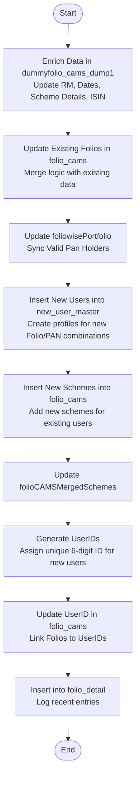

# Upload Folio CAMS
This API processes and synchronizes CAMS folio data from the temporary dump collection (`dummyfolio_cams_dump1`) into the main system tables. It performs data enrichment, updates existing records, creates new user profiles, and logs portfolio details.

### User flow diagram


### Method
```
POST
```

### Route
```
/upload/upload-folio-cams
```
*(Note: Route prefix `/upload` assumed based on typical structure, or it might be root `/upload-folio-cams` based on the snippet provided. Adjust based on actual route mounting).* 
*Based on request snippet: `router.post('/upload-folio-cams', ...)`* 

### Authorization
```
Bearer <token>
```

### Parameters
None. The API triggers processing of data already loaded into the staging collection `dummyfolio_cams_dump1`.

### Request Body
```json
{}
```

### Response `Status: (200)`
```json
{
    "success": true,
    "message": "Success"
}
```

### Response `Status: (500)`
```json
{
    "success": false,
    "message": "<Error Message>"
}
```
