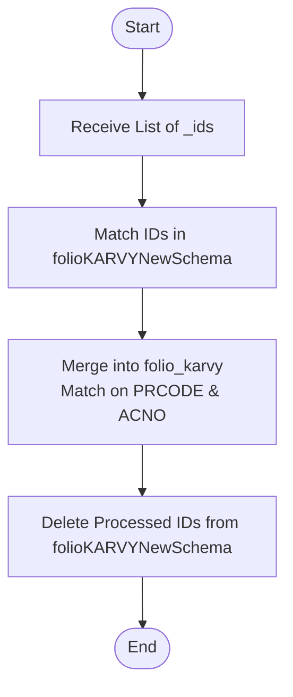

# Upload New Folio Karvy
This API confirms and processes specific new KARVY folios. It takes a list of selected portfolio IDs from the `folioKARVYNewSchema` (staging), merges them into the main `folio_karvy` collection, and then removes them from the staging collection. This is typically used after a user reviews the "New Folio Karvy List".

### User flow diagram


### Method
```
POST
```

### Route
```
/upload/upload-folio-karvy-new
```
*(Note: Route prefix `/upload` assumed based on project structure).*

### Authorization
```
Bearer <token>
```

### Parameters
None.

### Request Body
```json
{
    "_id": [
        "ObjectId1",
        "ObjectId2",
        "ObjectId3"
    ]
}
```

### Response `Status: (200)`
```json
{
    "success": true,
    "message": "Success",
    "data": {
        "newFolios": [
            // List of processed/merged folio objects
        ]
    }
}
```

### Response `Status: (500)`
```json
{
    "success": false,
    "message": "<Error Message>"
}
```
