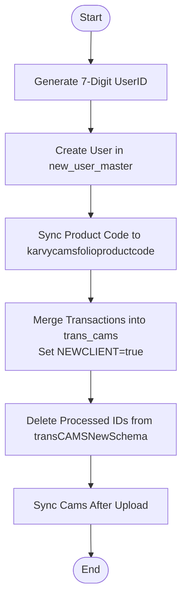

# Upload New Folio Trans Cams
This API processes and merges new CAMS transaction folios. It takes a list of selected staging IDs from `transCAMSNewSchema` (handling one primarily but structured for batch in the request), generates a new unique User ID, creates a new user profile in `new_user_master`, merges product codes into `karvycamsfolioproductcode`, and finally moves the transaction data into the main `trans_cams` collection before cleaning up the staging data and triggering a sync.

### User flow diagram


### Method
```
POST
```

### Route
```
/upload/upload-folio-transcams
```
*(Note: Route prefix `/upload` assumed based on project structure).*

### Authorization
```
Bearer <token>
```

### Parameters
None.

### Request Body
```json
{
    "_id": [
        "ObjectId"
    ]
}
```
*(Note: The controller currently takes an array but primarily processes logic based on `_id[0]`, especially for user creation. However, the subsequent aggregations filter by the entire `_id` array).*

### Response `Status: (200)`
```json
{
    "success": true,
    "message": "Success"
}
```

### Response `Status: (500)`
```json
{
    "success": false,
    "message": "<Error Message>"
}
```
