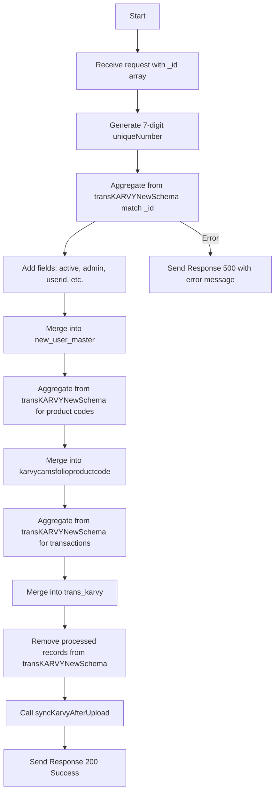

# Upload New Folio TransKarvy
This API handles the uploading of new folio transaction data for Karvy. It generates a unique user ID, processes and merges data into `new_user_master`, `karvycamsfolioproductcode`, and `trans_karvy` collections, and finally removes the processed records from the temporary schema.

### User flow diagram


### Method
```
POST
```

### Route
```
/upload/upload-folio-transkarvy
```

### Authorization
```
Bearer <token>
```

### Request Body
```json
{
    "_id": ["64f8a...", "64f8b..."]
}
```

### Response `Status: (200)`
```json
{
    "code": 200,
    "status": true,
    "message": "Success"
}
```

### Response `Status: (500)`
```json
{
    "code": 500,
    "status": false,
    "message": "<error message>"
}
```
