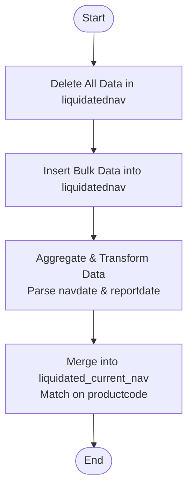

# Upload Karvy NAV
This API uploads and processes Karvy Net Asset Value (NAV) data. It clears the temporary staging collection (`liquidatednav`), inserts new bulk data, tranforms date fields, and updates the current NAV records in the `liquidated_current_nav` collection.

### User flow diagram


### Method
```
POST
```

### Route
```
/upload/upload-karvy-nav
```
*(Note: Route prefix `/upload` assumed based on project structure. The route defined in code is `/upload-karvy-nav` relative to the router).*

### Authorization
```
Bearer <token>
```

### Parameters
None.

### Request Body
```json
{
    "uploaddata": [
        {
            "productcode": "String",
            "scheme": "String",
            "isin": "String",
            "navdate": "DD/MM/YYYY",
            "reportdate": "DD/MM/YYYY",
            "navrs": Number,
            "repurprice": Number,
            "saleprice": Number
        }
    ]
}
```

### Response `Status: (200)`
```json
{
    "success": true,
    "message": "Successfully uploaded",
    "data": {
        "length": <number_of_records_inserted>
    }
}
```

### Response `Status: (500)`
```json
{
    "success": false,
    "message": "<Error Message>"
}
```
