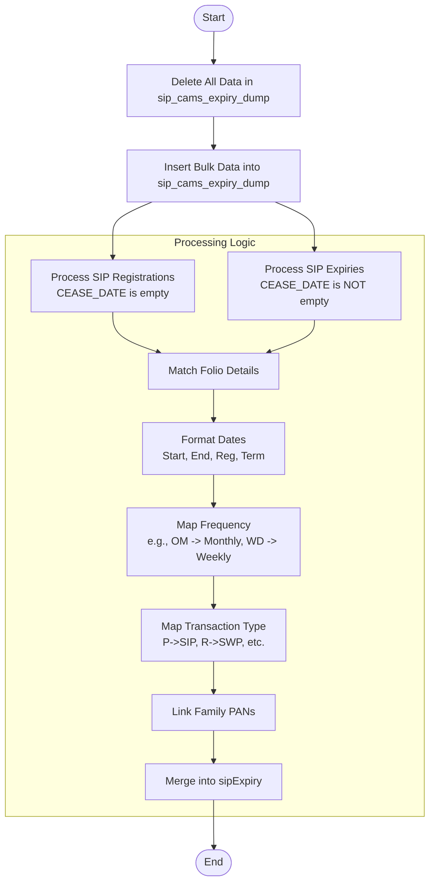

# Upload SIP Cams Expiry
This API processes CAMS SIP (Systematic Investment Plan) expiry and registration data. It uploads raw data into a dump collection (`sip_cams_expiry_dump`) and then processes it into the main `sipExpiry` collection. It handles two types of records: active SIP registrations (where cease date is empty) and expired/ceased SIPs. The process involves enriching data with folio details, mapping frequencies, identifying transaction types (SIP/SWP/STP), and linking family member PANs.

### User flow diagram


### Method
```
POST
```

### Route
```
/upload/upload-sip-cams-expiry
```
*(Note: Route prefix `/upload` assumed based on project structure. The route defined in code is `/upload-sip-cams-expiry` relative to the router).*

### Authorization
```
Bearer <token>
```

### Parameters
None.

### Request Body
```json
{
    "uploaddata": [
        {
            "FOLIO_NO": "String",
            "PRODUCT": "String",
            "AUTO_AMOUN": "Number/String",
            "FROM_DATE": "DD/MM/YYYY",
            "TO_DATE": "DD/MM/YYYY",
            "CEASE_DATE": "DD/MM/YYYY or Empty",
            "REG_DATE": "DD/MM/YYYY",
            "PERIODICIT": "Code (e.g., O, OM, Q)",
            "AUT_TRNTYP": "Code (e.g., P, R)",
            "AUTO_TRNO": "String",
            "INV_NAME": "String"
            // ... other fields present in the upload
        }
    ]
}
```

### Response `Status: (200)`
```json
{
    "success": true,
    "message": "Successfully uploaded"
}
```

### Response `Status: (500)`
```json
{
    "success": false,
    "message": "<Error Message>"
}
```
