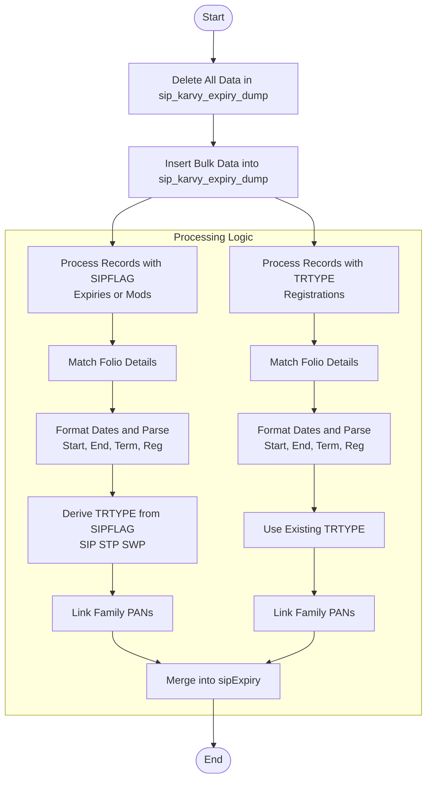

# Upload SIP Karvy Expiry
This API processes Karvy SIP (Systematic Investment Plan) expiry and registration data. It uploads raw data into a staging collection (`sip_karvy_expiry_dump`) and then processes it into the main `sipExpiry` collection. The API handles two distinct data formats/types: records with a `SIPFLAG` (typically expiries or modifications) and records with a `TRTYPE` (typically registrations).

### User flow diagram


### Method
```
POST
```

### Route
```
/upload/upload-sip-karvy-expiry
```
*(Note: Route prefix `/upload` assumed based on project structure. The route defined in code is `/upload-sip-karvy-expiry` relative to the router).*

### Authorization
```
Bearer <token>
```

### Parameters
None.

### Request Body
```json
{
    "uploaddata": [
        {
            "ACNO": "String",
            "PRODCODE": "String",
            "AMOUNT": "Number/String",
            "STARTDATE": "DD/MM/YYYY",
            "ENDDATE": "DD/MM/YYYY",
            "TERMDATE": "DD/MM/YYYY",
            "SIPREGDT": "DD/MM/YYYY",
            "REGDATE": "DD/MM/YYYY",
            "SIPFLAG": "String (Optional)",
            "TRTYPE": "String (Optional)",
            "IHNO": "String",
            "INVNAME": "String",
            "FREQ": "String"
            // ... other fields
        }
    ]
}
```

### Response `Status: (200)`
```json
{
    "success": true,
    "message": "Successfully uploaded"
}
```

### Response `Status: (500)`
```json
{
    "success": false,
    "message": "<Error Message>"
}
```
