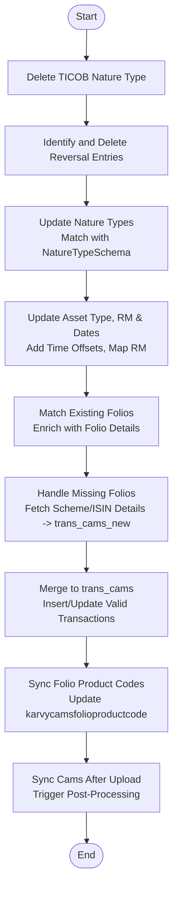

# Upload Trans Cams
This API processes and synchronizes CAMS transaction data from the temporary dump collection (`transCamsDump1`) into the main CAMS transaction table (`trans_cams`). It performs extensive data cleaning, enrichment, and synchronization, including handling reversals, updating nature types, mapping schemes, and syncing folio product codes.

### User flow diagram


### Method
```
POST
```

### Route
```
/upload/upload-trans-cams
```
*(Note: Route prefix `/upload` assumed based on project structure. The route defined in code is `/upload-trans-cams` relative to the router).*

### Authorization
```
Bearer <token>
```

### Parameters
None. The API triggers processing of data already loaded into the staging collection `transCamsDump1` (and `transCamsDump1Schema`).

### Request Body
```json
{}
```

### Response `Status: (200)`
```json
{
    "success": true,
    "message": "Success"
}
```

### Response `Status: (500)`
```json
{
    "success": false,
    "message": "<Error Message>"
}
```
