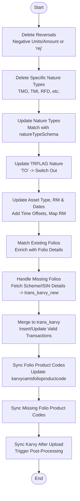

# Upload Trans Karvy
This API processes and synchronizes KARVY transaction data from the temporary dump collection (`transKarvyDump1`) into the main KARVY transaction table (`trans_karvy`). It handles data cleaning, reversals, nature type mapping, folio matching, and product code synchronization.

### User flow diagram


### Method
```
POST
```

### Route
```
/upload/upload-trans-karvy
```
*(Note: Route prefix `/upload` assumed based on project structure. The route defined in code is `/upload-trans-karvy` relative to the router).*

### Authorization
```
Bearer <token>
```

### Parameters
None. The API triggers processing of data already loaded into the staging collection `transKarvyDump1` (and `transKarvyDump1Schema`).

### Request Body
```json
{}
```

### Response `Status: (200)`
```json
{
    "success": true,
    "message": "Success"
}
```

### Response `Status: (500)`
```json
{
    "success": false,
    "message": "<Error Message>"
}
```
