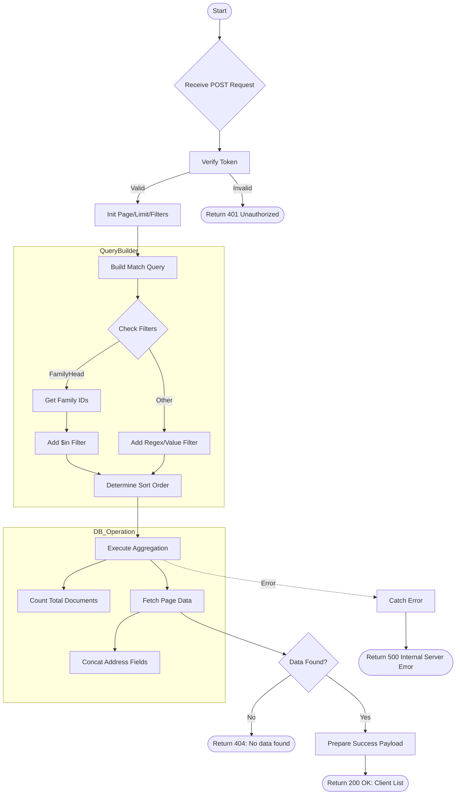

# Get Client List
Retrieve a paginated, filtered, and sorted list of clients. Support filtering by various fields and family head.

### User flow diagram


### Method
```
POST
```

### Route
```
/user/client-list
```

### Authorization
```
Bearer <token>
```

### Request Body
```json
{
    "page": 1,
    "limit": 10,
    "filters": {
        "folioname": "John",
        "pan": "ABCDE1234F",
        "rm": "RM123",
        "familyHead": "UserId123",
        "address": "Street",
        "gpan": "ABCDE1234F",
        "mobile": "9876543210",
        "email": "john@example.com",
        "city": "New York",
        "pincode": "10001"
    },
    "isAdmin": false,
    "order": "asc",
    "orderBy": "folioname"
}
```

### Response `Status: (200)`
```json
{
    "status": true,
    "message": "Client list found successful",
    "payload": {
        "length": 1,
        "total": 50,
        "clientList": [
            {
                "userid": "user123",
                "folioname": "John Doe",
                "pan": "ABCDE1234F",
                "add1": "123 Street Name Apt 4",
                "mobile": "9876543210",
                "email": "john@example.com",
                "rmid": "RM123",
                "familyhead": "head123"
            }
        ]
    }
}
```

### Response `Status: (404)`
```json
{
    "status": false,
    "message": "No data found"
}
```

### Response `Status: (500)`
```json
{
    "status": false,
    "message": "Internal Server Error"
}
```
