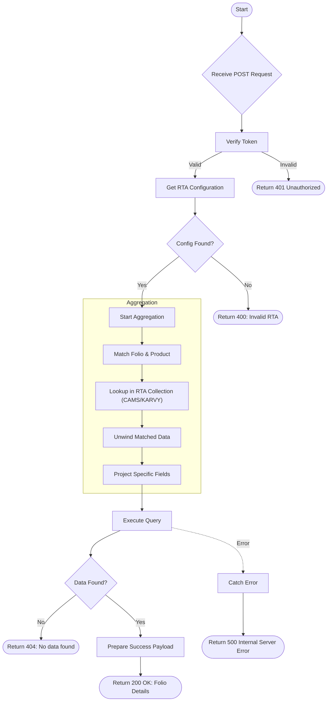

# Get Client List Folio Details
Retrieve detailed information for a specific folio based on the Registrar and Transfer Agent (RTA).

### User flow diagram


### Method
```
POST
```

### Route
```
/user/client-list-folio-details
```

### Authorization
```
Bearer <token>
```

### Request Body
```json
{
    "folio": "123456789",
    "product": "Product Name",
    "rta": "CAMS"
}
```
OR
```json
{
    "folio": "987654321",
    "product": "Product Name",
    "rta": "KARVY"
}
```

### Response `Status: (200)`
```json
{
    "status": true,
    "message": "Successful",
    "payload": {
        "folioDetail": [
            {
                "folioname": "John Doe",
                "mappedname": "John Doe",
                "pan": "ABCDE1234F",
                "folio": "123456789",
                "product": "Product Name",
                "scheme": "Scheme Name",
                "email": "john@example.com",
                "mobile": "9876543210",
                "dob": "1990-01-01",
                "bank": "Bank Name",
                "account": "1234567890",
                "...": "Other RTA specific fields"
            }
        ]
    }
}
```

### Response `Status: (400)`
```json
{
    "status": false,
    "message": "Invalid RTA"
}
```

### Response `Status: (404)`
```json
{
    "status": false,
    "message": "No data found"
}
```

### Response `Status: (500)`
```json
{
    "status": false,
    "message": "Internal Server Error"
}
```
