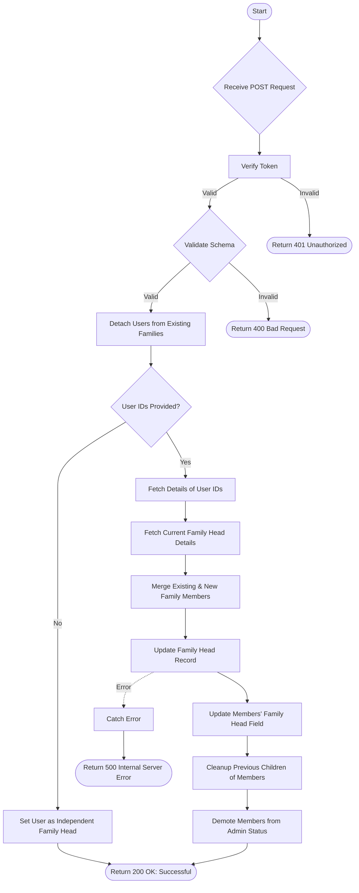

# Client List Set Family Head
Set a user as the Family Head and map other family members to them.

### User flow diagram


### Method
```
POST
```

### Route
```
/user/client-list-set-family-head
```

### Authorization
```
Bearer <token>
```

### Request Body
```json
{
    "familyHead": {
        "userId": "UserHead123",
        "name": "Head Name"
    },
    "userids": ["Member1", "Member2"]
}
```

### Response `Status: (200)`
```json
{
    "status": true,
    "message": "Successful"
}
```

### Response `Status: (500)`
```json
{
    "status": false,
    "message": "Internal Server Error"
}
```
