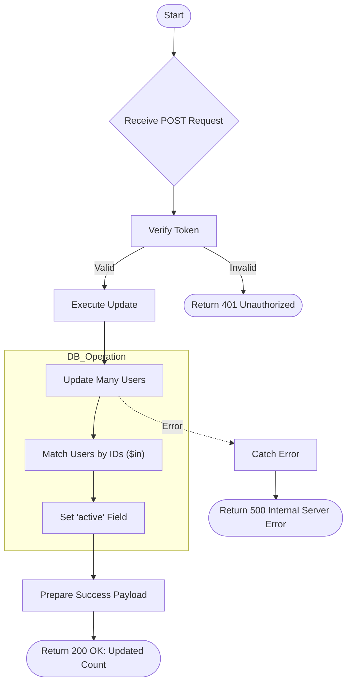

# Enable/Disable Client
Enable or disable access for multiple client accounts in bulk.

### User flow diagram


### Method
```
POST
```

### Route
```
/user/enable-disable-client
```

### Authorization
```
Bearer <token>
```

### Request Body
```json
{
    "active": true,
    "userid": ["user1", "user2", "user3"]
}
```

### Response `Status: (200)`
```json
{
    "status": true,
    "message": "Updated 3 users"
}
```

### Response `Status: (500)`
```json
{
    "status": false,
    "message": "Internal Server Error"
}
```
