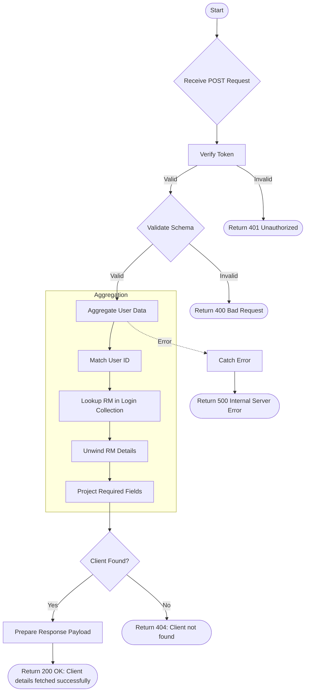

# Get Client Details By Name
Fetch detailed information about a client using their User ID, including mapped Relationship Manager (RM) details.

### User flow diagram


### Method
```
POST
```

### Route
```
/user/get-client-details-by-name
```

### Authorization
```
Bearer <token>
```

### Request Body
```json
{
    "userId": "USER12345"
}
```

### Response `Status: (200)`
```json
{
    "status": true,
    "message": "Client details fetched successfully",
    "payload": {
        "clientDetails": {
            "folioname": "Client Name",
            "mappedname": "Mapped Name",
            "pan": "ABCDE1234F",
            "add1": "Address Line 1",
            "add2": "Address Line 2",
            "add3": "Address Line 3",
            "gpan": "ABCDE1234F",
            "createdate": "2023-01-01T00:00:00.000Z",
            "userid": "USER12345",
            "active": true,
            "rm": "RM Name",
            "rmid": "RM001",
            "familymember": [],
            "admin": true,
            "familyhead": "Head Name",
            "rm_email": "rm@example.com",
            "rm_mobile": "9876543210",
            "aum": 100000,
            "email": "client@example.com",
            "city": "City Name",
            "pincode": "123456",
            "mobile": "9988776655",
            "dob": "1990-01-01"
        }
    }
}
```

### Response `Status: (404)`
```json
{
    "status": false,
    "message": "Client not found"
}
```

### Response `Status: (500)`
```json
{
    "status": false,
    "message": "Internal Server Error"
}
```
