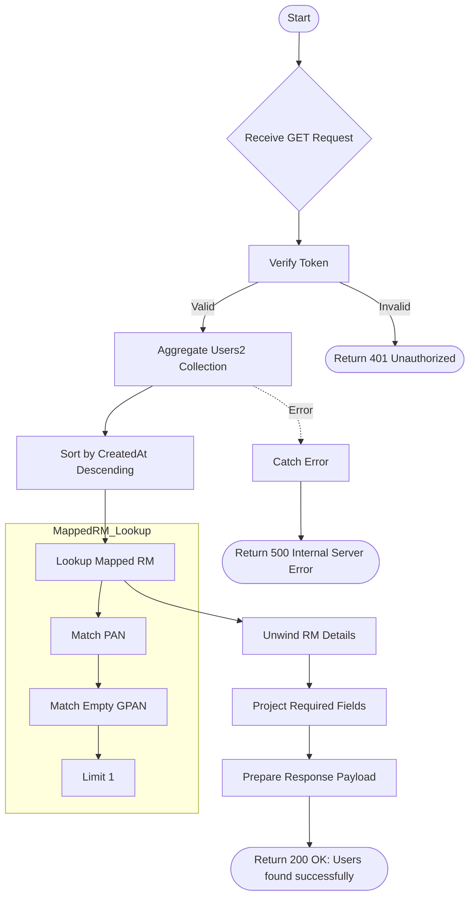

# Get New ProdigyPro User List
Fetch a list of new ProdigyPro users, sorted by creation date, with mapped Relationship Manager (RM) details if available.

### User flow diagram


### Method
```
GET
```

### Route
```
/user/get-new-prodigypro-userlist
```

### Authorization
```
Bearer <token>
```

### Parameters
| Name | Type | Description |
|------|------|-------------|
| None | - | - |

### Sample Request
```http
GET: https://<host>/user/get-new-prodigypro-userlist
```

### Response `Status: (200)`
```json
{
    "status": true,
    "message": "Users found successfully",
    "payload": {
        "length": 1,
        "userList": [
            {
                "mobile": "9876543210",
                "bankDetails": {},
                "createdAt": "2023-01-01T00:00:00.000Z",
                "doneKYC": true,
                "iins": [],
                "isVerified": true,
                "nomination": {},
                "otp": "1234",
                "otpAttempts": 0,
                "otpBlockedUntil": null,
                "personalDetails": {},
                "primaryIIN": null,
                "updatedAt": "2023-01-01T00:00:00.000Z",
                "userId": "USER123",
                "PAN": "ABCDE1234F",
                "name": "User Name",
                "rm": "RM Name"
            }
        ]
    }
}
```

### Response `Status: (500)`
```json
{
    "status": false,
    "message": "Internal Server Error"
}
```
