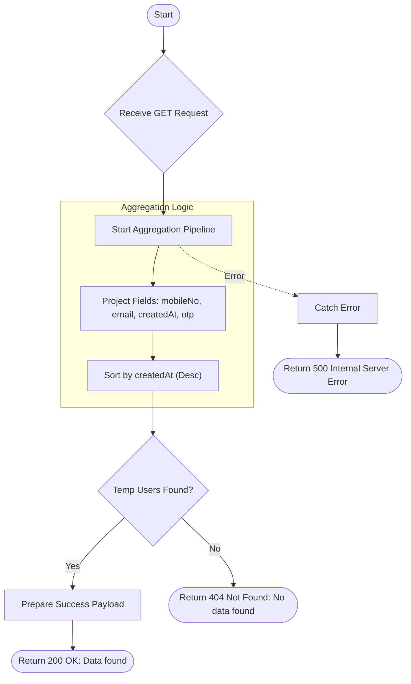

# Get Temp Users
Retrieve a list of temporary users (registrations with OTP/unverified status).

### User flow diagram


### Method
```
GET
```

### Route
```
/user/get-temp-user
```

### Authorization
```
Bearer <token>
```

### Parameters
| Name | Type | Description |
|------|------|-------------|
| - | - | No parameters required |

### Sample Request
```http
GET: https://localhost:3000/user/get-temp-user
```

### Response `Status: (200)`
```json
{
    "status": true,
    "message": "Success",
    "payload": {
        "tempUserList": [
            {
                "mobileNo": "1234567890",
                "userEmail": "temp.user@example.com",
                "createdAt": "2024-01-01T10:00:00.000Z",
                "otp": "1234"
            }
        ]
    }
}
```

### Response `Status: (404)`
```json
{
    "status": false,
    "message": "No data found"
}
```

### Response `Status: (500)`
```json
{
    "status": false,
    "message": "Internal Server Error"
}
```
