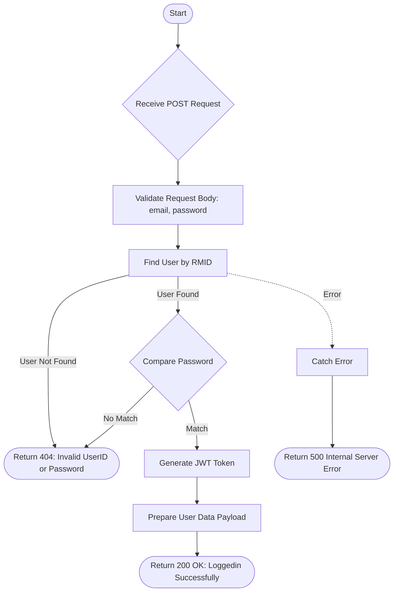

# Login Via Email
Authenticate a user using email and password.

### User flow diagram


### Method
```
POST
```

### Route
```
/login-user
```

### Authorization
```
Bearer <token>
```

### Request Body
```json
{
    "email": "user@example.com",
    "password": "password123"
}
```

### Response `Status: (200)`
```json
{
    "status": true,
    "message": "Loggedin Successfully",
    "payload": {
        "userData": {
            "userrole": "ADMIN",
            "name": "John Doe",
            "token": "eyJhbGciOiJIUzI1NiIsInR...",
            "rmid": "user@example.com"
        }
    }
}
```

### Response `Status: (404)`
```json
{
    "status": false,
    "message": "Invalid UserID or Password"
}
```

### Response `Status: (500)`
```json
{
    "status": false,
    "message": "Internal Server Error"
}
```
