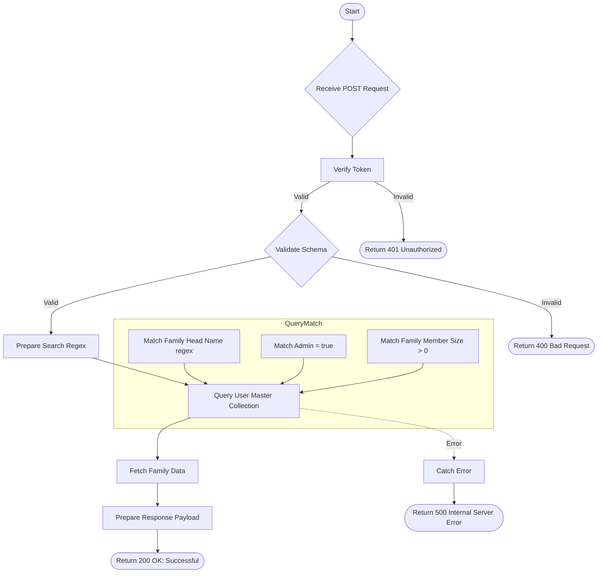

# Search Family Head
Search for users who are family heads (admin with family members) based on a search string.

### User flow diagram


### Method
```
POST
```

### Route
```
/user/search-family-head
```

### Authorization
```
Bearer <token>
```

### Request Body
```json
{
    "search": "Sharma"
}
```

### Response `Status: (200)`
```json
{
    "status": true,
    "message": "Successful",
    "payload": {
        "length": 2,
        "familyData": [
            {
                "familyhead": "Rajesh Sharma",
                "userid": "USER001",
                "pan": "ABCDE1234F",
                "gpan": "ABCDE1234F"
            },
            {
                "familyhead": "Suresh Sharma",
                "userid": "USER005",
                "pan": "FGHIJ5678K",
                "gpan": "FGHIJ5678K"
            }
        ]
    }
}
```

### Response `Status: (500)`
```json
{
    "status": false,
    "message": "Internal Server Error"
}
```
