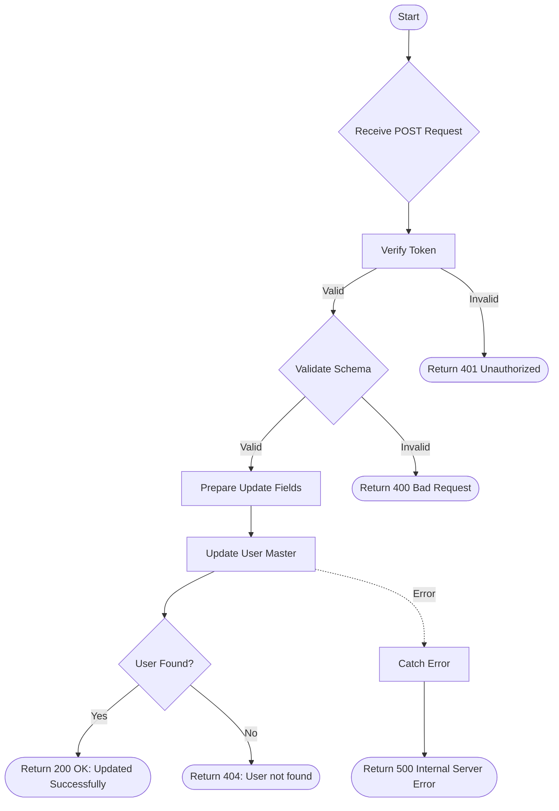

# Update Detail From Clientlist
Update specific details of a user/client such as email, mobile, address, city, pincode, and DOB.

### User flow diagram


### Method
```
POST
```

### Route
```
/user/update-clientlist-detail
```

### Authorization
```
Bearer <token>
```

### Request Body
```json
{
    "userid": "USER12345",
    "email": "newemail@example.com",
    "mobile": "9876543210",
    "add1": "Address Line 1",
    "add2": "Address Line 2",
    "add3": "Address Line 3",
    "city": "New City",
    "pincode": "654321",
    "dob": "1995-05-15"
}
```

### Response `Status: (200)`
```json
{
    "status": true,
    "message": "Updated Successfully"
}
```

### Response `Status: (404)`
```json
{
    "status": false,
    "message": "User not found"
}
```

### Response `Status: (500)`
```json
{
    "status": false,
    "message": "Internal Server Error"
}
```
