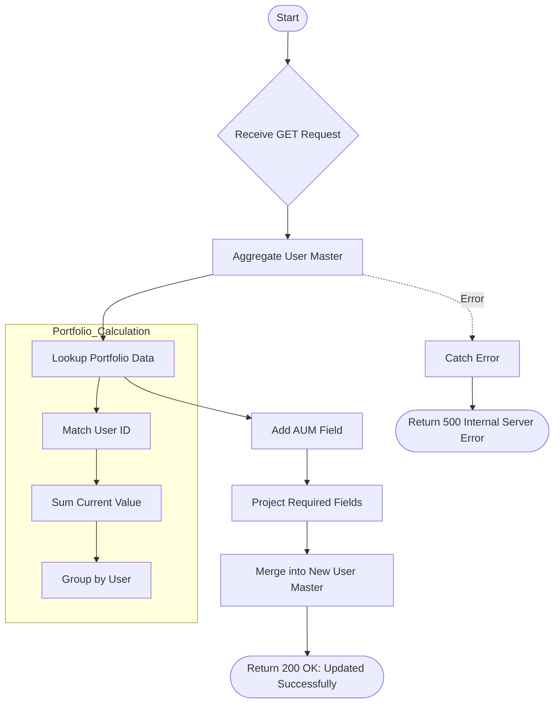

# Update Usermaster AUM
Calculates and updates the Assets Under Management (AUM) for all users in the User Master collection by aggregating data from their portfolios.

### User flow diagram


### Method
```
GET
```

### Route
```
/user/update-usermaster-aum
```

### Authorization
```
None
```

### Parameters
| Name | Type | Description |
|------|------|-------------|
| None | - | - |

### Sample Request
```http
GET: https://<host>/user/update-usermaster-aum
```

### Response `Status: (200)`
```json
{
    "status": true,
    "message": "Updated Successfully"
}
```

### Response `Status: (500)`
```json
{
    "status": false,
    "message": "Internal Server Error"
}
```
