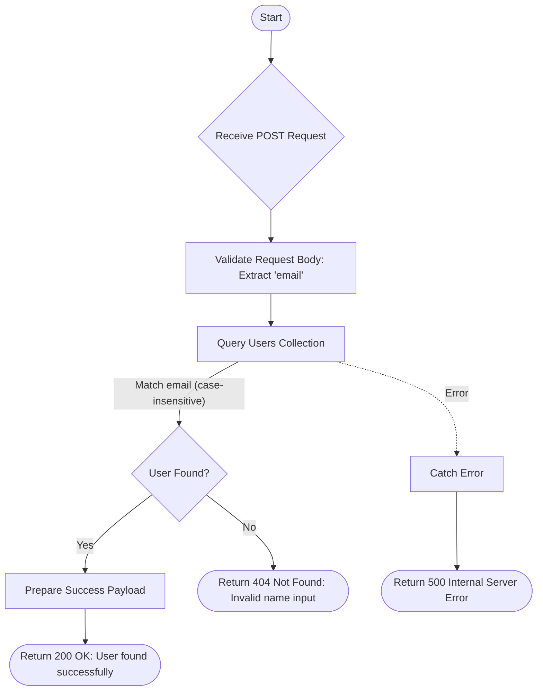

# User Via Email
Search for user by email using a case-insensitive exact match.

### User flow diagram


### Method
```
POST
```

### Route
```
/user/user-via-email
```

### Authorization
```
Bearer <token>
```

### Request Body
```json
{
    "email": "john.doe@example.com"
}
```

### Response `Status: (200)`
```json
{
    "status": true,
    "message": "User found successfully",
    "payload": {
        "userList": {
            "name": "John Doe",
            "mobileNo": "1234567890",
            "PAN": "ABCDE1234F",
            "city": "New York",
            "address": "123 Street Name",
            "country": "Country Name",
            "userEmail": "john.doe@example.com",
            "createdAt": "2024-01-01T10:00:00.000Z"
        }
    }
}
```

### Response `Status: (404)`
```json
{
    "status": false,
    "message": "Invalid name input"
}
```
