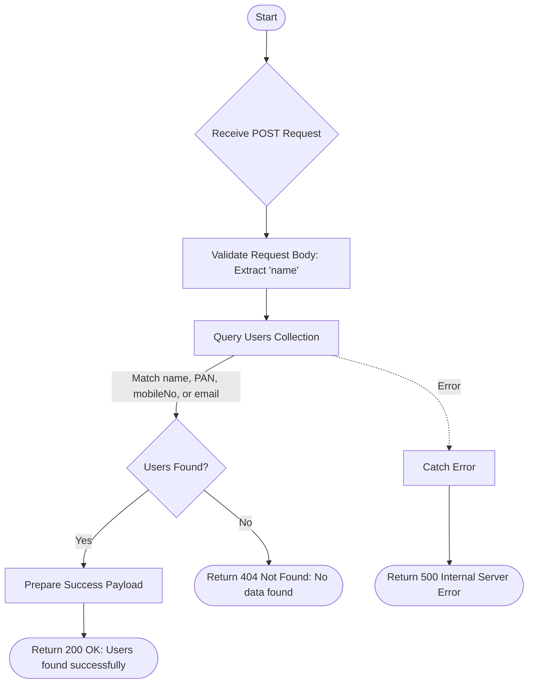

# User Via Name
Search for users by name, PAN, mobile number, or email using a regex match.

### User flow diagram


### Method
```
POST
```

### Route
```
/user/user-via-name
```

### Authorization
```
Bearer <token>
```

### Request Body
```json
{
    "name": "search_term"
}
```

### Response `Status: (200)`
```json
{
    "status": true,
    "message": "Users found successfully",
    "payload": {
        "userList": [
            {
                "name": "John Doe",
                "mobileNo": "1234567890",
                "PAN": "ABCDE1234F",
                "city": "New York",
                "address": "123 Street Name",
                "country": "Country Name",
                "userEmail": "john.doe@example.com",
                "createdAt": "2024-01-01T10:00:00.000Z"
            }
        ]
    }
}
```

### Response `Status: (404)`
```json
{
    "status": false,
    "message": "No data found"
}
```
