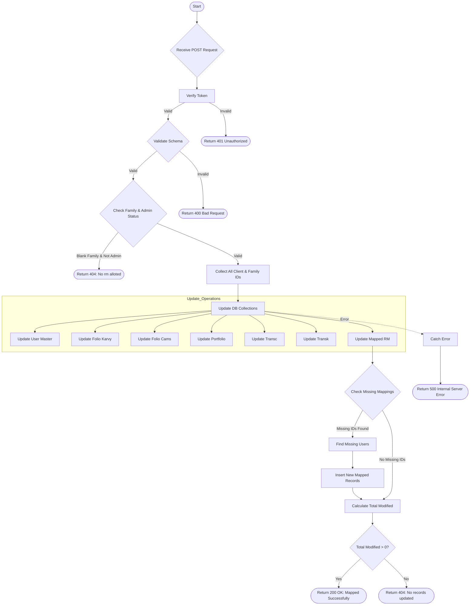

# Client List RM Mapping
Map a Relationship Manager (RM) to a list of clients and their family members.

### User flow diagram


### Method
```
POST
```

### Route
```
/user/client-list-rm-mapping
```

### Authorization
```
Bearer <token>
```

### Request Body
```json
{
    "clientIds": ["USER123", "USER456"],
    "rm": "RM Name",
    "rmId": "RM001"
}
```

### Response `Status: (200)`
```json
{
    "status": true,
    "message": "Mapped Successfully 7 records updated",
    "payload": {
        "totalmodified": 7
    }
}
```

### Response `Status: (404)`
```json
{
    "status": false,
    "message": "No rm alloted"
}
```
OR
```json
{
    "status": false,
    "message": "No records updated"
}
```

### Response `Status: (500)`
```json
{
    "status": false,
    "message": "Internal Server Error"
}
```
