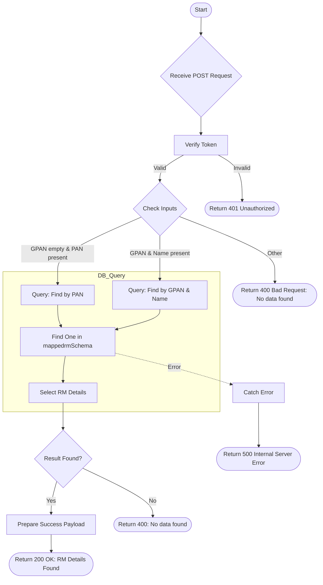

# Check Client Mapped RM
Determine which Relationship Manager (RM) is mapped to a specific client based on PAN or GPAN details.

### User flow diagram


### Method
```
POST
```

### Route
```
/user/client-mapped-rm
```

### Authorization
```
Bearer <token>
```

### Request Body
```json
{
    "pan": "ABCDE1234F",
    "gpan": "",
    "name": ""
}
```
OR
```json
{
    "pan": "",
    "gpan": "ABCDE1234F",
    "name": "Client Name"
}
```

### Response `Status: (200)`
```json
{
    "status": true,
    "message": "Success",
    "payload": {
        "mappedRm": {
            "RM": "RM Name",
            "RMID": "RM123",
            "CLIENTNAME": "Client Name",
            "PAN": "ABCDE1234F",
            "GPAN": "ABCDE1234F",
            "ENTRY_DATE": "2024-01-01T10:00:00.000Z"
        }
    }
}
```

### Response `Status: (400)`
```json
{
    "status": false,
    "message": "No data found"
}
```

### Response `Status: (500)`
```json
{
    "status": false,
    "message": "Internal Server Error"
}
```
