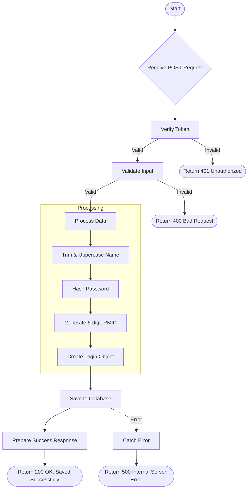

# Create RM
Register a new Relationship Manager (RM) with their details.

### User flow diagram


### Method
```
POST
```

### Route
```
/user/create-rm
```

### Authorization
```
Bearer <token>
```

### Request Body
```json
{
    "rm": "RM Name",
    "mobile": "9876543210",
    "email": "rm@example.com",
    "password": "password123"
}
```

### Response `Status: (200)`
```json
{
    "status": true,
    "message": "Saved Successfully."
}
```

### Response `Status: (500)`
```json
{
    "status": false,
    "message": "Internal Server Error"
}
```
