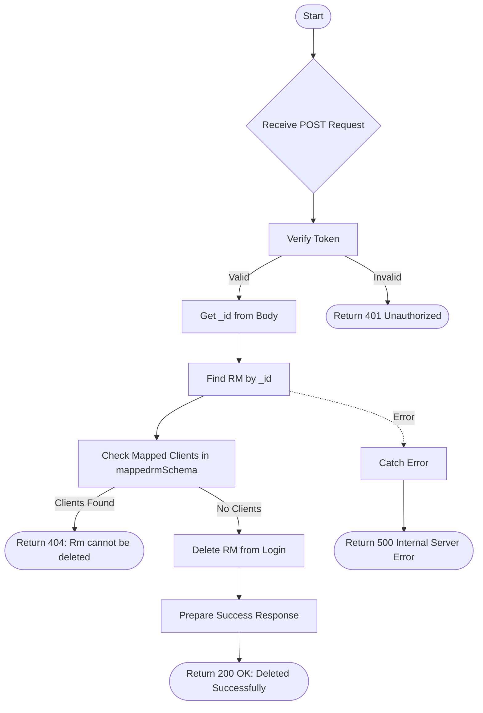

# Delete RM
Delete a Relationship Manager (RM) from the system, provided they have no mapped clients.

### User flow diagram


### Method
```
POST
```

### Route
```
/user/delete-rm
```

### Authorization
```
Bearer <token>
```

### Request Body
```json
{
    "_id": "60d5ec49f1b2c82a8c8e1234"
}
```

### Response `Status: (200)`
```json
{
    "status": true,
    "message": "Deleted Successfully"
}
```

### Response `Status: (404)`
```json
{
    "status": false,
    "message": "Rm cannot be deleted"
}
```

### Response `Status: (500)`
```json
{
    "status": false,
    "message": "Internal Server Error"
}
```
