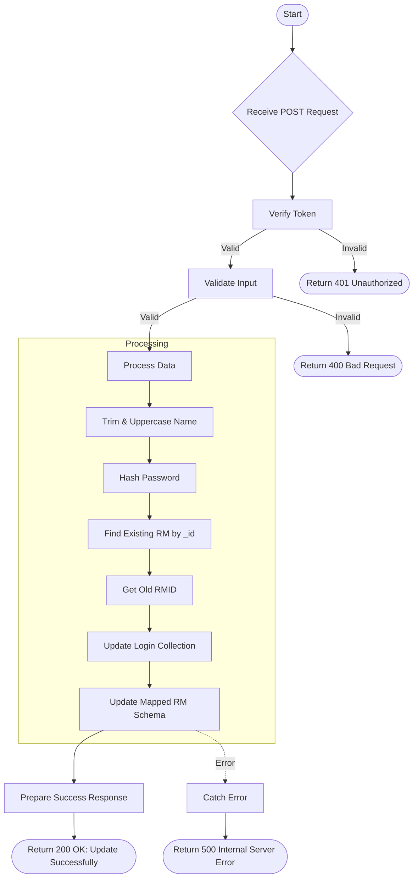

# Edit RM
Update the details of an existing Relationship Manager (RM).

### User flow diagram


### Method
```
POST
```

### Route
```
/user/edit-rm
```

### Authorization
```
Bearer <token>
```

### Request Body
```json
{
    "_id": "60d5ec49f1b2c82a8c8e1234",
    "rm": "Updated RM Name",
    "mobile": "9876543210",
    "email": "updated.rm@example.com",
    "rmid": "RM999",
    "password": "newpassword123"
}
```

### Response `Status: (200)`
```json
{
    "status": true,
    "message": "Update Successfully."
}
```

### Response `Status: (500)`
```json
{
    "status": false,
    "message": "Internal Server Error"
}
```
