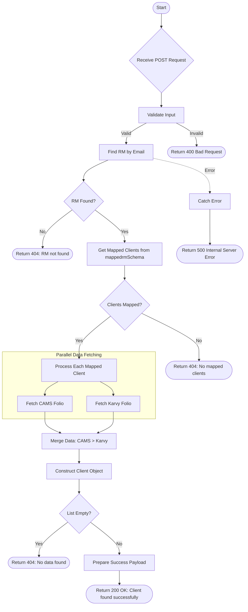

# Get RM Client List for Chorus
Retrieve a detailed list of clients mapped to a specific Relationship Manager (RM) for Chorus integration, consolidating data from CAMS and Karvy.

### User flow diagram


### Method
```
POST
```

### Route
```
/user/rm-client-list-chorus
```

### Authorization
```
Bearer <token>
```

### Request Body
```json
{
    "email": "rm@example.com"
}
```

### Response `Status: (200)`
```json
{
    "status": true,
    "message": "Client found successfully",
    "payload": {
        "length": 1,
        "list": [
            {
                "CLIENT_NAME": "Client Name",
                "CLIENT_PAN": "ABCDE1234F",
                "CLIENT_MOBILE": "9876543210",
                "CLIENT_EMAIL": "client@example.com",
                "CLIENT_DOB": "1990-01-01",
                "CLIENT_ADD1": "Address Line 1",
                "CLIENT_ADD2": "Address Line 2",
                "CLIENT_ADD3": "Address Line 3",
                "CLIENT_CITY": "City",
                "CLIENT_STATE": "State",
                "CLIENT_COUNTRY": "Country",
                "CLIENT_MAPPED_DATE": "2024-01-01",
                "RM_NAME": "RM Name",
                "RM_ID": "RM123",
                "RM_EMAIL": "rm@example.com",
                "RM_MOBILE": "9876543210"
            }
        ]
    }
}
```

### Response `Status: (404)`
```json
{
    "status": false,
    "message": "RM not found / No mapped clients / No data found"
}
```

### Response `Status: (500)`
```json
{
    "status": false,
    "message": "Internal Server Error"
}
```
