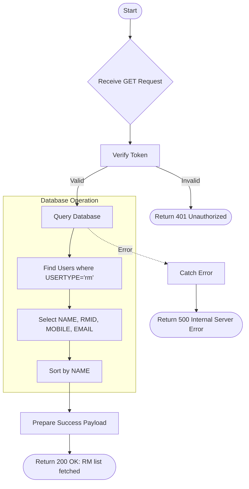

# Get RM List
Retrieve a list of Relationship Managers (RMs) with their contact details.

### User flow diagram


### Method
```
GET
```

### Route
```
/user/rm-list
```

### Authorization
```
Bearer <token>
```

### Parameters
| Name | Type | Description |
|------|------|-------------|
| - | - | No parameters required |

### Sample Request
```http
GET /user/rm-list HTTP/1.1
Host: <host>
Authorization: Bearer <token>
```

### Response `Status: (200)`
```json
{
    "status": true,
    "message": "Success",
    "payload": {
        "list": [
            {
                "_id": "60d5ec49f1b2c82a8c8e1234",
                "NAME": "RM Name",
                "RMID": "RM123",
                "MOBILE": "9876543210",
                "EMAIL": "rm@example.com"
            }
        ]
    }
}
```

### Response `Status: (500)`
```json
{
    "status": false,
    "message": "Internal Server Error"
}
```
