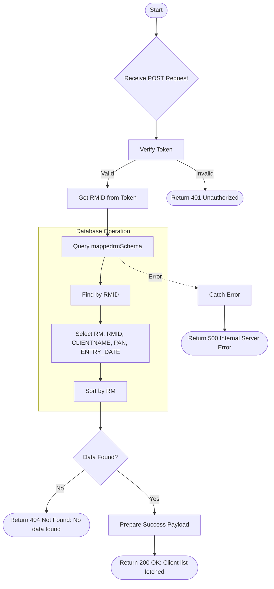

# Get Logged-in RM Client List
Retrieve a list of clients mapped to the currently logged-in Relationship Manager (RM).

### User flow diagram


### Method
```
POST
```

### Route
```
/user/rm-login-clients
```

### Authorization
```
Bearer <token>
```

### Parameters
| Name | Type | Description |
|------|------|-------------|
| - | - | No parameters required |

### Sample Request
```http
POST /user/rm-login-clients HTTP/1.1
Host: <host>
Authorization: Bearer <token>
```

### Response `Status: (200)`
```json
{
    "status": true,
    "message": "Successful",
    "payload": {
        "list": [
            {
                "_id": "60d5ec49f1b2c82a8c8e9012",
                "RM": "RM Name",
                "RMID": "RM123",
                "CLIENTNAME": "Client Name",
                "PAN": "ABCDE1234F",
                "ENTRY_DATE": "2024-01-01T10:00:00.000Z"
            }
        ]
    }
}
```

### Response `Status: (404)`
```json
{
    "status": false,
    "message": "No data found"
}
```

### Response `Status: (500)`
```json
{
    "status": false,
    "message": "Internal Server Error"
}
```
