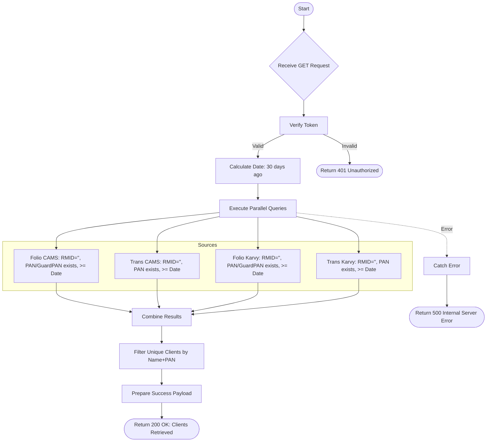

# Unmapped RM List
Retrieve a list of clients who are not mapped to any Relationship Manager (RM) based on activity in the last 30 days.

### User flow diagram


### Method
```
GET
```

### Route
```
/user/unmapped-rm-list
```

### Authorization
```
Bearer <token>
```

### Parameters
| Name | Type | Description |
|------|------|-------------|
| - | - | No parameters required |

### Sample Request
```http
GET /user/unmapped-rm-list HTTP/1.1
Host: <host>
Authorization: Bearer <token>
```

### Response `Status: (200)`
```json
{
    "status": true,
    "message": "Unmapped clients retrieved successfully",
    "payload": {
        "length": 1,
        "unmappedClients": [
            {
                "NAME": "Client Name",
                "PAN": "ABCDE1234F",
                "MOBILE": "9876543210",
                "EMAIL": "client@example.com",
                "DATE": "2024-01-01T10:00:00.000Z"
            }
        ]
    }
}
```

### Response `Status: (500)`
```json
{
    "status": false,
    "message": "Internal Server Error"
}
```
